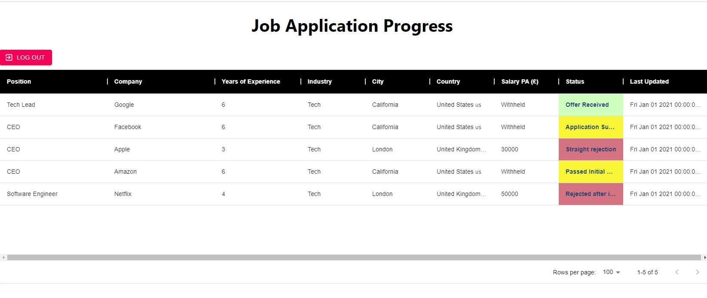

## Getting Started with Create React App
This project was bootstrapped with [Create React App](https://github.com/facebook/create-react-app).

## Job Tracker Overview
This is a simple CRUD application using react to track the job applications you apply to. It can do the following things:

- Make an account to save all the jobs you have applied for. 
- Add a job application where you can input various things about the job such as company name, location, salary and status.
- Update the status of your application.
- View all your applications in an interactive table. Click on the table fields to sort values. 

## Screenshot example

Please feel free to register an account. If you just want to interact with the app, you can use these test login details. Note that adding job applications have been disabled on this test account.

Email: demo_user@fake-email.com

Password: job12345

Link to the live version (using firebase hosting): https://job-app-4a4bf.web.app/

## Backend

The backend is Google firebase - firestore.

## File structure

Please see the README file in the src folder to see the file structures.
